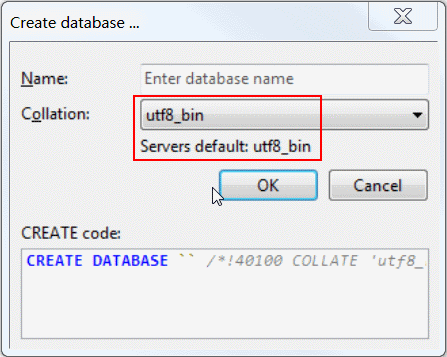

# e01-mysql-56-container
> definition of a mysql-56 container in which the file configuration and data is stored outside the container

## Description
This file contains technical details describing how the container image was built and some info about the decisions taken.

For details about how to build the container image and run it, please refer to the container's [README.md](./mysql56-container/README.md).

The container found in [./e01-mysql56-container](./e01-mysql56-container/) is a simple MySQL 5.6 server docker container specification in which some time was spent to provide a flexible way to customize the server and map the data files to a volumen outside of the container.

For the customization part, the directory [./e01-mysql56-container/mysql-custom-config](./e01-mysql56-container/mysql-custom-config) defined in the working directory can contain a mysql.cnf file with the custom configuration, and that file will be mapped to `/etc/mysql/conf.d` inside the container.
This file has been initialized with a *UTF8* configuration and a specific location of the mysql log file.

For the stateless part, the directory `mysql-data` is mapped to `/var/lib/mysql` inside the container. Thus, all the stateful data generated by the container will be available in the host file system, and can be reused with different containers.

You can check that both customizations are working by:
+ Connecting to the server and creating a new database. You will see that `uft8_bin` is selected as a default for the database type. 
+ Running a cat on `./mysql-data/mysql.log` and validating that it exists and contains updated entries.