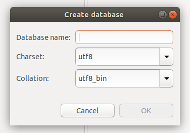

# e17 &mdash; MySQL 8.0 container with volume mapping
> a MySQL 8.0 server container in which the configuration file and data directories are mapped to host directories

## Description
This file contains technical details describing how the container image was built and some info about the decisions taken.

For details about how to build the container image and run it, please refer to the container's [README.md](./mysql80-container/README.md).

The container specification found in [./mysql80-container](./mysql80-container/) is a simple MySQL 8.0 server Dockerfile that allows for customization of the database server options and maps MySQL data and log files to a volume on the host.

For the customization part, the directory [./mysql80-container/mysql-custom-config](./mysql80-container/mysql-custom-config) defined in the working directory contains a `mysql.cnf` file in which you can include your custom database server options. When the container is started, that file will be mapped to `/etc/mysql/conf.d` inside the container.

| NOTE: |
| :---- |
| In the directory you will a `mysql.cnf` that includes some basic configuration that sets *UTF8* as the character set, and customizes the location of MySQL log file. |

To achieve the statelessness of the container, the directory `/var/lib/mysql/` inside the container is mapped to `mysql-data/` in the working directory. Thus, all the stateful data generated by the container will be available in the host file system, and can be reused with different containers.

You can check that both customizations are working by:
+ Connecting to the server and creating a new database. You will see that `uft8_bin` is selected as a default for the database type. 
+ Running a cat on `./mysql-data/mysql.log` and validating that it exists and contains updated entries.